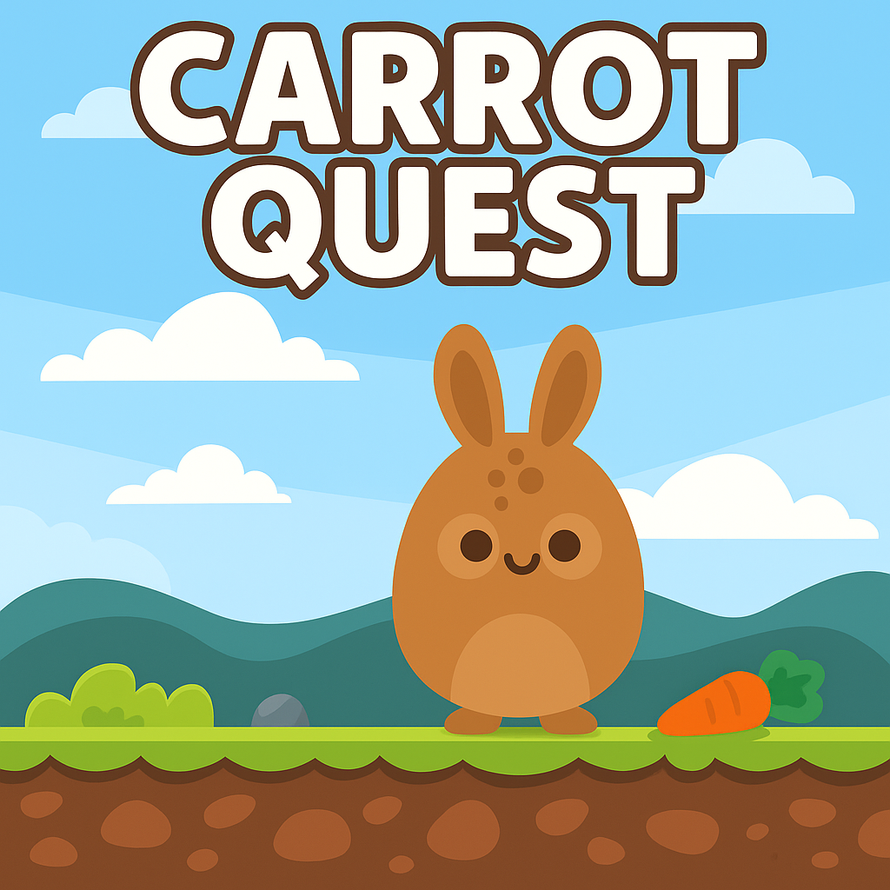

# CarrotQuest

CarrotQuest is a simple arcade-style game I built with Pygame for my students in my CS course on Introduction to Programming in Python. You control a rabbit that moves left and right to catch falling carrots. Every carrot you catch increases your score. The game includes basic collision detection, sound effects, and animated sprites.


<div align="left">
  
</div>


## Requirements

To run this game, you need to have:

- Python 3.6 or higher
- Pygame (version 2.0 or higher)

### Install Pygame

```bash
pip install pygame

